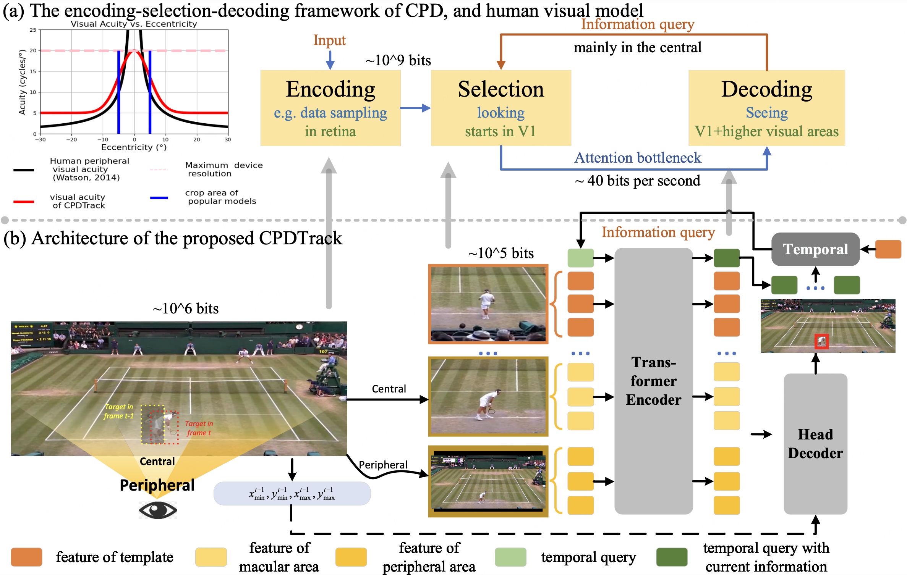

# CPDTrack [NeurIPS 2024]

NeurIPS 2024 paper [CPDTrack](https://proceedings.neurips.cc/paper_files/paper/2024/hash/050f8591be3874b52fdac4e1060eeb29-Abstract-Conference.html) official implement.



## Abstract

Human visual search ability enables efficient and accurate tracking of an arbitrary moving target, which is a significant research interest in cognitive neuroscience. The recently proposed Central-Peripheral Dichotomy (CPD) theory sheds light on how humans effectively process visual information and track moving targets in complex environments. 
However, existing visual object tracking algorithms still fall short of matching human performance in maintaining tracking over time, particularly in complex scenarios requiring robust visual search skills. These scenarios often involve \textbf{S}patio-\textbf{T}emporal \textbf{D}iscontinuities (\ie, \textit{STDChallenge}), prevalent in long-term tracking and global instance tracking.
To address this issue, we conduct research from a human-like modeling perspective:
(1) Inspired by the CPD, we propose a new tracker named \textbf{CPDTrack} to achieve human-like visual search ability. The central vision of CPDTrack leverages the spatio-temporal continuity of videos to introduce priors and enhance localization precision, while the peripheral vision improves global awareness and detects object movements.
(2) To further evaluate and analyze \textit{STDChallenge}, we create the \textbf{\textit{STDChallenge Benchmark}}. Besides, by incorporating human subjects, we establish a human baseline, creating a high-quality environment specifically designed to assess trackers' visual search abilities in videos across \textit{STDChallenge}.
(3) Our extensive experiments demonstrate that the proposed CPDTrack not only achieves state-of-the-art (SOTA) performance in this challenge but also narrows the behavioral differences with humans. Additionally, CPDTrack exhibits strong generalizability across various challenging benchmarks.
In summary, our research underscores the importance of human-like modeling and offers strategic insights for advancing intelligent visual target tracking.

## Results

### Mechine Benchamrk
| Motion Model | Method | STDChallenge SUC | VideoCube SUC | VideoCube R-OPE SUC | LaSOT AUC |
| :--- | :--- | :---: | :---: | :---: | :---: |
| CPD | CPDTrack | 65.9 | **70.4** | **75.6** | 66.1 |
| Local Crop | SeqTrack  | **66.8** | 63.5 | 72.5 | **69.9** |
| | OSTrack  | 64.6 | 61.8 | 71.3 | 69.1 | 
| | MixViT  | 66.7 | 63.1 | 72.7 | 69.6 |
| | STARK  | 64.5 | 62.1 | 70.4 | 67.1 |
| | KeepTrack | 62.8 | 54.3 | 64.4 | 67.1 |
| | Ocean  | 40.7 | 34.2 | 51.2 | 56.0 |
| | SuperDiMP | 56.5 | 47.4 | 61.2 | 64.1 |
| | PrDiMP  | 52.7 | 44.5 | 58.3 | 59.8 |
| | DiMP  | 48.6 | 37.1 | 56.0 | 56.9 |
| | SiamRPN  | 37.3 | 29.0 | 50.3 | - |
| | ATOM  | 40.8 | 26.7 | 53.1 | 51.5 |
| | KYS  | 44.5 | 33.7 | 59.4 | 55.4 |
| | SiamFC  | 20.6 | 7.4 | 35.6 | 33.6 |
| Local-Global | SPLT  | 40.3 | 33.7 | 47.6 | 39.9 | 
| | DaSiamRPN | 37.1 | 29.1 | 50.4 | 42.7 | 
| Global | SiamRCNN | 60.7 | 58.8 | 65.8 | 64.8 | 
| | GlobalTrack | 49.5 | 46.1 | 53.7 | 52.1 | 

### Visual Turing Test

| Motion Model | Method | STDChallenge-Turing N-PRE | error consistency |
| :--- | :--- | :---: | :---: |
| Human | Exp 02 | - | 0.954 |
| | Exp 05 | - | 0.946 |
| | Exp 01 | - | 0.945 |
| | Exp 04 | - | 0.925 |
| | Exp 03 | - | 0.922 |
| **CPD** | **CPDTrack** | **0.853** | **0.167** |
| Local Crop | SeqTrack | 0.825 | 0.129 |
| | OSTrack | 0.806 | 0.155 |
| | MixViT | 0.790 | 0.155 |
| | STARK | 0.807 | 0.146 |
| | KeepTrack| 0.746 | 0.117 |
| | Ocean | 0.623 | 0.061 |
| | SuperDiMP| 0.756 | 0.097 |
| | PrDiMP | 0.687 | 0.061 |
| | DiMP | 0.717 | 0.059 |
| | SiamRPN | 0.561 | 0.044 |
| | ATOM | 0.614 | 0.053 |
| | KYS | 0.655 | 0.066 |
| | SiamFC | 0.300 | 0.017 |
| Local-Global | SPLT | 0.634 | 0.068 |
| | DaSiamRPN| 0.571 | 0.046 |
| Global | SiamRCNN | 0.734 | 0.141 |
| | GlobalTrack| 0.641 | 0.073 |


## Usage

### Train and Test
The code is currently being organized.


### Visual Turing Test

<!-- 基于长时跟踪数据集（LaSOT）构建STDChallenge，计算STD指标
并根据STD指标，从中抽取难度均匀分布的序列以进行图灵测试 -->

We construct the STDChallenge based on long-term tracking datasets (LaSOT, VOTLT2019, VideoCube) and calculate the *STD* metric. Based on this metric, we sample sequences with uniformly distributed difficulty to conduct a visual turing test.


Following SOTVerse, the folder stucture of dataset before processing should be as below:

```n
|-- LaSOT/
|  |-- attribute/
|  |  |-- absent/
|  |  |  |-- airplane-1.txt
|  |  |  ...
|  |  |  |-- airplane-10.txt
|  |  |-- shotcut/
|  |  |  |-- airplane-1.txt
|  |  |  ...
|  |  |  |-- airplane-10.txt
|  |  |  ...
|  |-- data/
|  |  |-- airplane/
|  |  |  |-- airplane-1/
|  |  |  |  | ...
```


```shell
python build_dataset.py
```

Following the construction of the dataset, we conduct a visual turing test.
```shell
python turing_test.py
```

### Evaluation

Following VideoCube, we provide an evaluation of the Pre, N-Pre, and SUC attributes on STDChallenge. Additionally, we include SUC plots varying with the STD metric and an evaluation of error consistency.


```shell
python test_vrct.py
```


## Citation

If CPDTrack supports or enhances your research, please acknowledge our work by citing our paper. Thank you!

```bibtex
@article{zhang2024beyond,
  title={Beyond accuracy: Tracking more like human via visual search},
  author={Zhang, Dailing and Hu, Shiyu and Feng, Xiaokun and Li, Xuchen and Zhang, Jing and Huang, Kaiqi and others},
  journal={Advances in Neural Information Processing Systems},
  volume={37},
  pages={2629--2662},
  year={2024}
}
```


